# Robot Descriptions

This Repository contains the URDF and SRDF files for the quadruped, humanoid and manipulator robot. All sorted as ros2 packages.

I collect them from internet and repaint some of them, better visualization can make me coding happier. ☺️

## Humanoid Robots

| Brand    | Model                                      | Repaint | Images                                                     |
|----------|--------------------------------------------|---------|------------------------------------------------------------|
| Booster  | [T1](humanoid/Booster/t1_description/)     | Yes     | 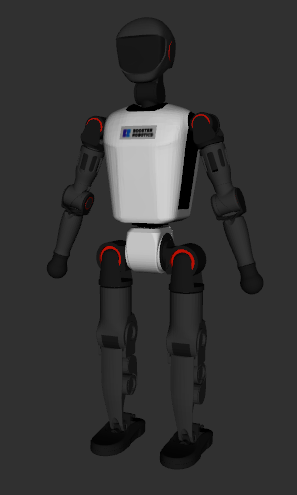    |
| RobotEra | [xbot](humanoid/RobotEra/xbot_description) | Yes     | 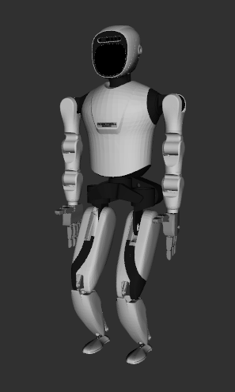 |

## Manipulator Robots

| Brand          | Model                                                         | Repaint | Images                                                                                                                                                                                                                                                              |
|----------------|---------------------------------------------------------------|---------|---------------------------------------------------------------------------------------------------------------------------------------------------------------------------------------------------------------------------------------------------------------------|
| TheRobotStudio | [SO-ARM](manipulator/Dobot/so_arm_description)                | No      | 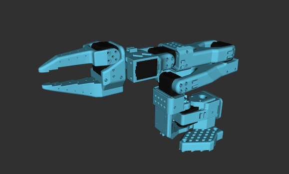                                                                                                                                              |
| Dobot          | [CR5](manipulator/Dobot/cr5_description)                      | Yes     |       |
| ARX            | [R5](manipulator/ARX/r5_description)                          | Yes     | 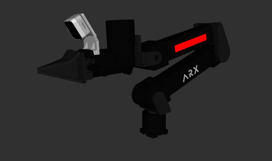                                                                                                                                                                                                              |
| ARX            | [X5](manipulator/ARX/x5_description)                          | Yes     |                                                                                                                                                                                                               |
| ARX            | [LIFT](manipulator/ARX/lift_description)                      | Yes     | 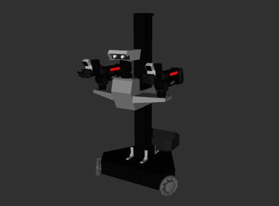     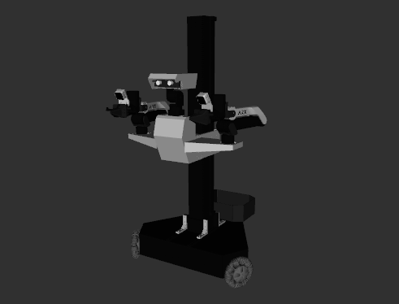            |
| ARX            | [X7S](manipulator/ARX/x7s_description)                        | Yes     |                                                                                                                                                                                                              |
| AgileX         | [Piper](manipulator/AgileX/piper_description)                 | Yes     | 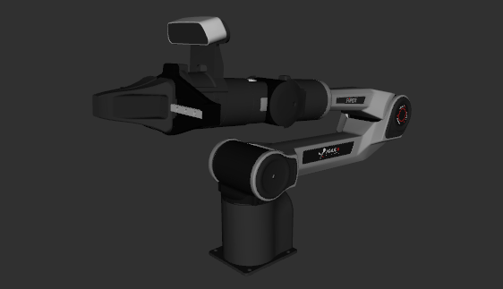 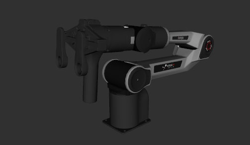  |
| AgileX         | [Mobile ALoha2](manipulator/AgileX/mobile_aloha2_description) | Yes     |                                                                                                                                                                                                        |
| Galaxea        | [A1X / A1Y](manipulator/Galaxea/a1xy_description)             | Yes     |  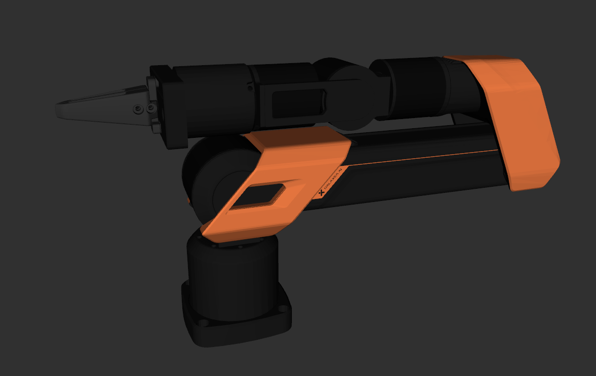           |
| Airbots        | [Play](manipulator/Airbots/airbot_play_description)           | Yes     | 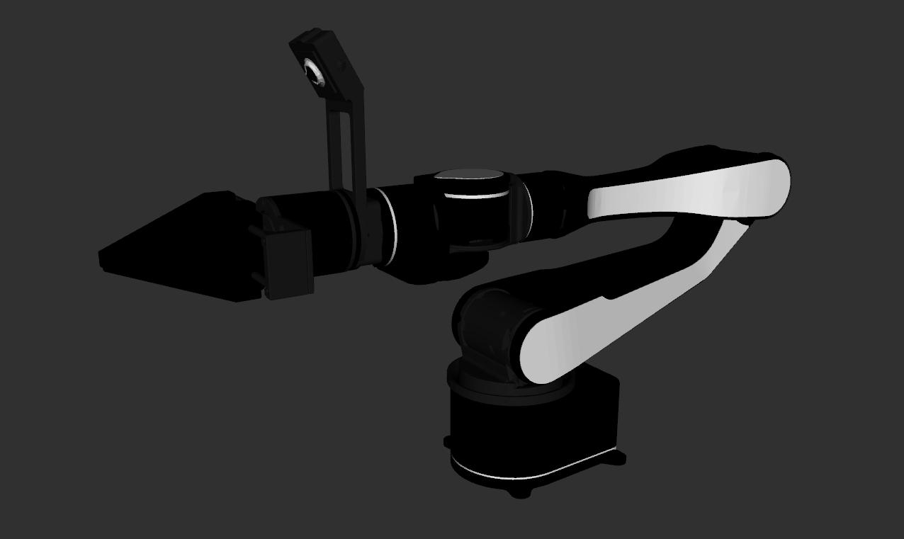                                                                                                                                                                                                         |

### Manipulator Robots with OCS2
I add mobile manipulator OCS2 config for some of the manipulator robots, you can use them with the `manipulator_ocs2.launch.py` launch file. More details can be found in the [OCS2 documentation](docs/OCS2.md).

## Grippers
| Brand                                  | Model | Mimic | Images                                                                                                                 | Collision                                                                                                                        |
|----------------------------------------|-------|-------|------------------------------------------------------------------------------------------------------------------------|----------------------------------------------------------------------------------------------------------------------------------|
| [Robotiq](gripper/robotiq_description) | 85    | Yes   | 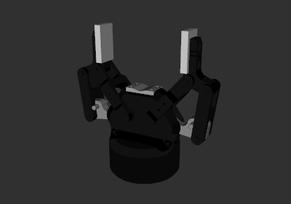 | 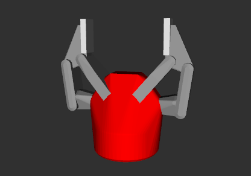 |

## Quadruped Robots

| Brand         | Model                                              | Repaint | Images                                                        |
|---------------|----------------------------------------------------|---------|---------------------------------------------------------------|
| Unitree       | [A1](quadruped/unitree/a1_description)             | No      | 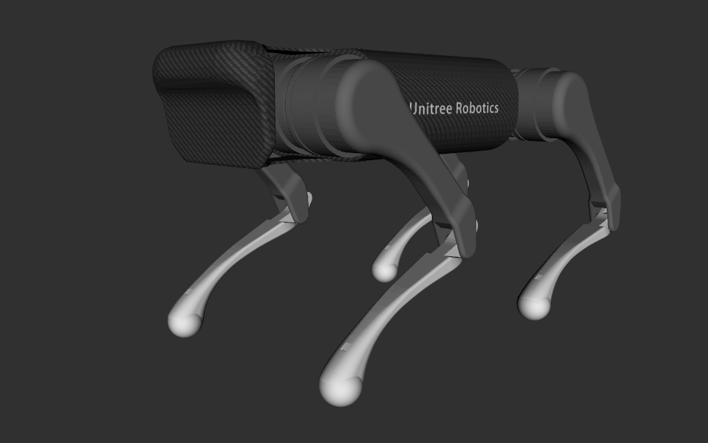      |
| Unitree       | [Aliengo](quadruped/unitree/aliengo_description)   | No      | 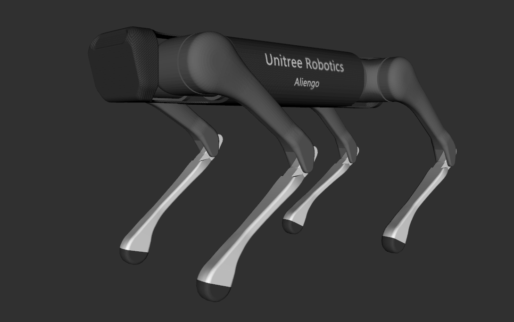 |
| Unitree       | [Go1](quadruped/unitree/go1_description)           | Yes     | 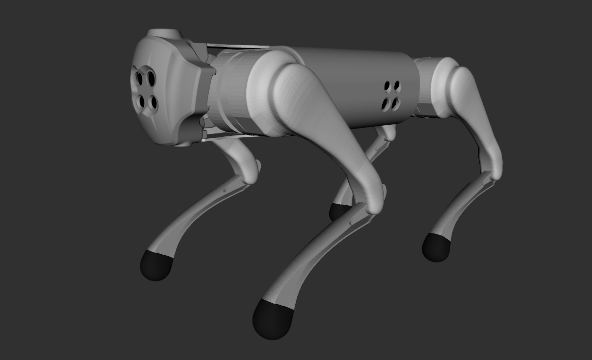     |
| Unitree       | [Go2](quadruped/unitree/go2_description)           | No      | 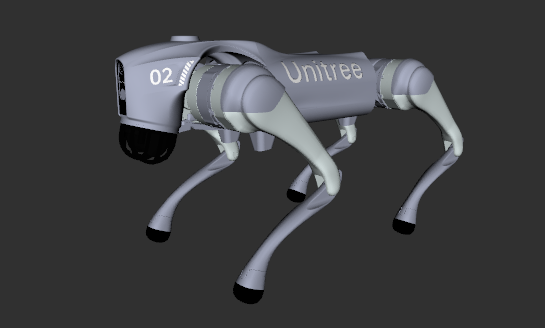     |
| Unitree       | [B2](quadruped/unitree/b2_description)             | No      | 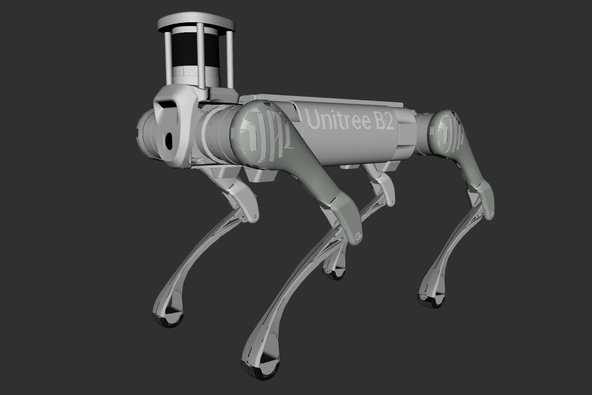      |
| Deep Robotics | [Lite3](quadruped/deep_robotics/lite3_description) | Yes     | 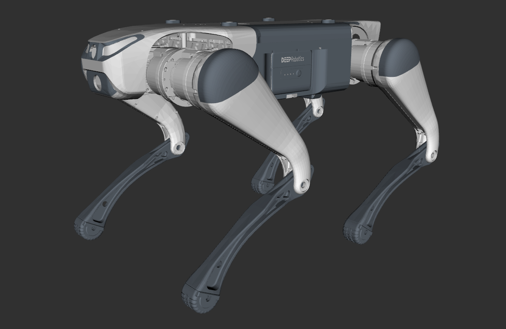      |
| Deep Robotics | [X30](quadruped/deep_robotics/x30_description)     | Yes     | 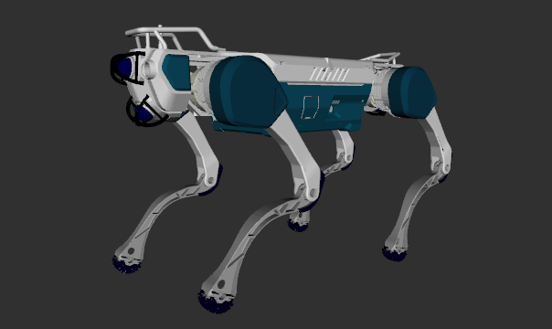        |