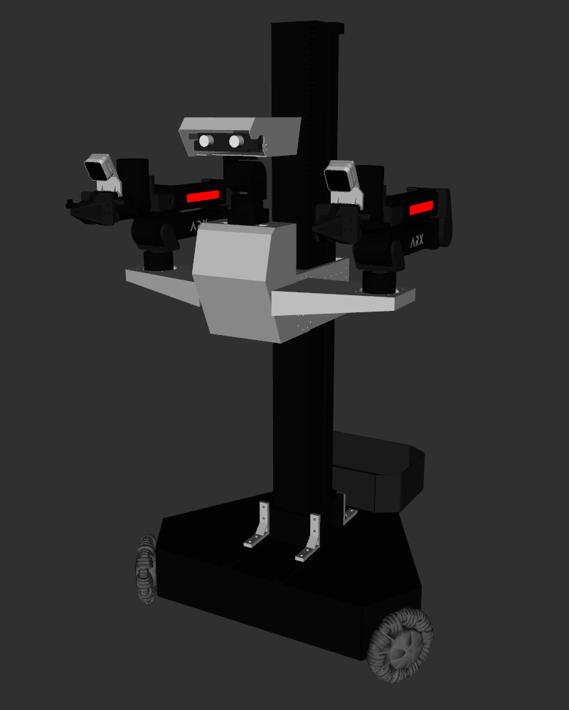
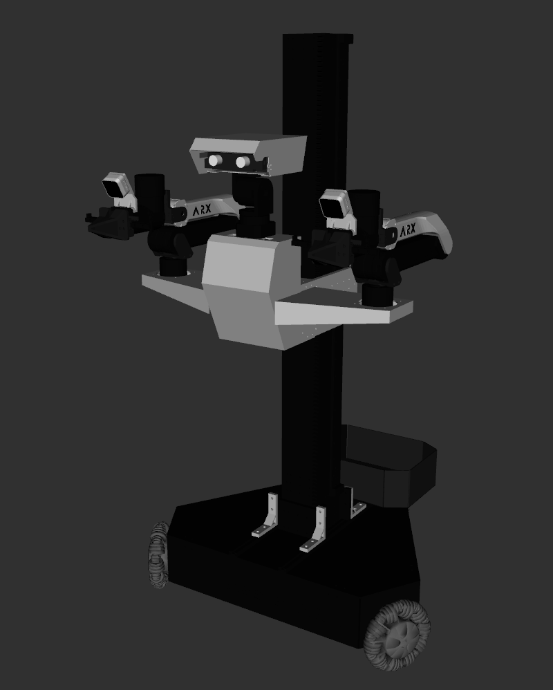
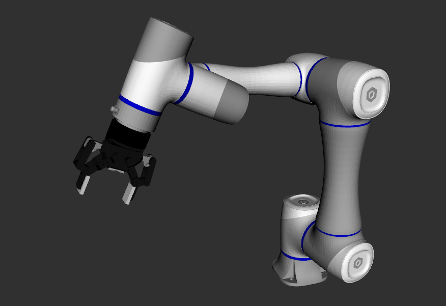
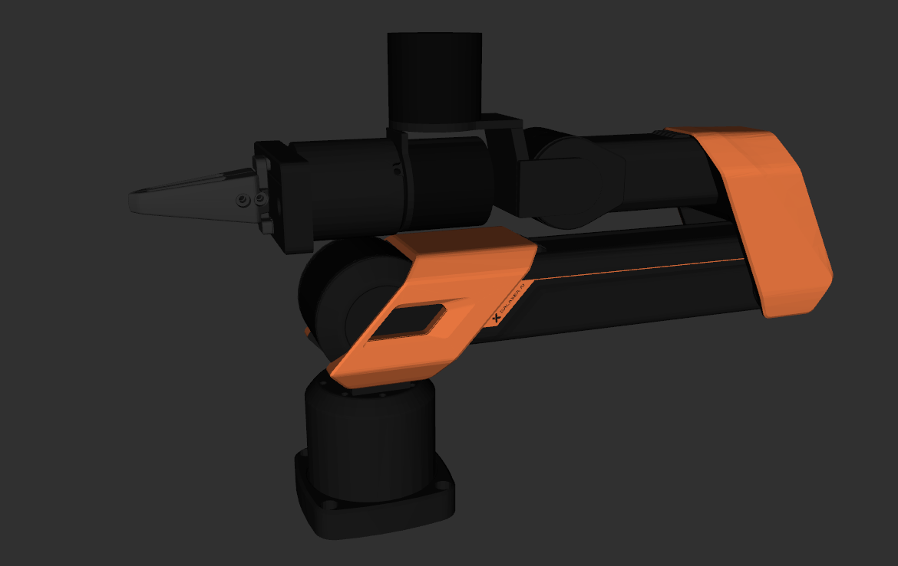
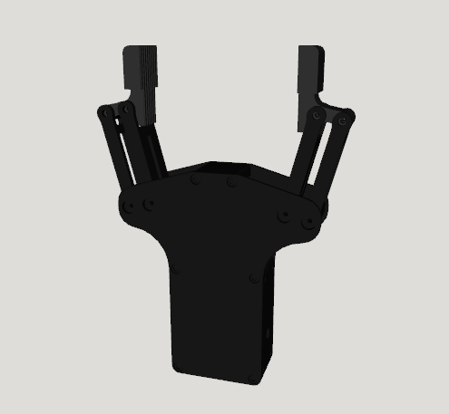

# Robot Descriptions

This repository contains the URDF files for quadruped, humanoid, and manipulator robots, all organized as ROS2 packages. Most of them have been repainted in Blender for better visualization. ☺️

## Humanoid Robots

| Brand    | Model                                         | Repaint | Images                                                                                                                                                                                                                   |
|----------|-----------------------------------------------|---------|--------------------------------------------------------------------------------------------------------------------------------------------------------------------------------------------------------------------------|
| Booster  | [T1](humanoid/Booster/t1_description/)        | Yes     |                                                                                                               |
| RobotEra | [xbot](humanoid/RobotEra/xbot_description)    | Yes     |                                                                                                                                                                |
| Agibot   | [G1](humanoid/Agibot/agibot_g1_description)   | No      |                                                                                                                                                                    |
| Galaxea  | [R1](humanoid/Galaxea/galaxea_r1_description) | Yes     |                                                                                                       |
| ARX      | [LIFT](humanoid/ARX/lift_description)         | Yes     |       |
| ARX      | [X7S](humanoid/ARX/x7s_description)           | Yes     |                                                                                                                                                                      |
| Realman  | [AIDAL](humanoid/Realman/aidal_description)   | Yes     |                                                                                                                                                                |

## Manipulator Robots

| Brand          | Model                                                       | Repaint | Images                                                                                                                                                                                                                                                                                                                                                                                |
|----------------|-------------------------------------------------------------|---------|---------------------------------------------------------------------------------------------------------------------------------------------------------------------------------------------------------------------------------------------------------------------------------------------------------------------------------------------------------------------------------------|
| TheRobotStudio | [SO-ARM](manipulator/LeRobot/so_arm_description)            | Yes     |                                                                                                                                           |
| SIGRobotics    | [Lekiwi](manipulator/LeRobot/lekiwi_description)            | Yes     |                                                                                                                                 |
| Dobot          | [CR5](manipulator/Dobot/cr5_description)                    | Yes     |                                                                                                                         |
| ARX            | [X5/R5](manipulator/ARX/arx5_description)                   | Yes     |                                                                                                                                                                                                                                                                           |
| AgileX         | [Piper](manipulator/AgileX/piper_description)               | Yes     |                                                                                                                      |
| AgileX         | [AgileX Aloha](manipulator/AgileX/agilex_aloha_description) | Yes     |                                                                                                                                                                                                                                                        |
| Galaxea        | [A1/A1X/A1Y](manipulator/Galaxea/galaxea_a1_description)    | Yes     |    |
| Airbots        | [Play](manipulator/Airbots/airbot_play_description)         | Yes     |                                                                                                                                                                                                                                                                                                                            |
| Realman        | [RM65](manipulator/Realman/rm65_description)                | Yes     |                                                                                                                                                                                                                                                                                                                           |

### Manipulator Robots with OCS2

I add mobile manipulator OCS2 config for some of the manipulator robots, you can use them with the
`manipulator_ocs2.launch.py` launch file. More details can be found in the [OCS2 documentation](docs/OCS2.md).

 

## Grippers

| Brand                                          | Model | Mimic | Images                                                                                                                   | Collision                                                                                                                        |
|------------------------------------------------|-------|-------|--------------------------------------------------------------------------------------------------------------------------|----------------------------------------------------------------------------------------------------------------------------------|
| [Robotiq](gripper/robotiq_description)         | 85    | Yes   |    |  |
| [Inspire EG2](gripper/inspire_eg2_description) | 85    | Yes   |  |  |
| [Galaxea G1](gripper/galaxea_g1_description)   | 85    | Yes   |   |  |

## Quadruped Robots

| Brand         | Model                                              | Repaint | Images                                                        |
|---------------|----------------------------------------------------|---------|---------------------------------------------------------------|
| Unitree       | [A1](quadruped/unitree/a1_description)             | No      |       |
| Unitree       | [Aliengo](quadruped/unitree/aliengo_description)   | No      |  |
| Unitree       | [Go1](quadruped/unitree/go1_description)           | Yes     |      |
| Unitree       | [Go2](quadruped/unitree/go2_description)           | No      |      |
| Unitree       | [B2](quadruped/unitree/b2_description)             | No      |       |
| Deep Robotics | [Lite3](quadruped/deep_robotics/lite3_description) | Yes     |       |
| Deep Robotics | [X30](quadruped/deep_robotics/x30_description)     | Yes     |         |