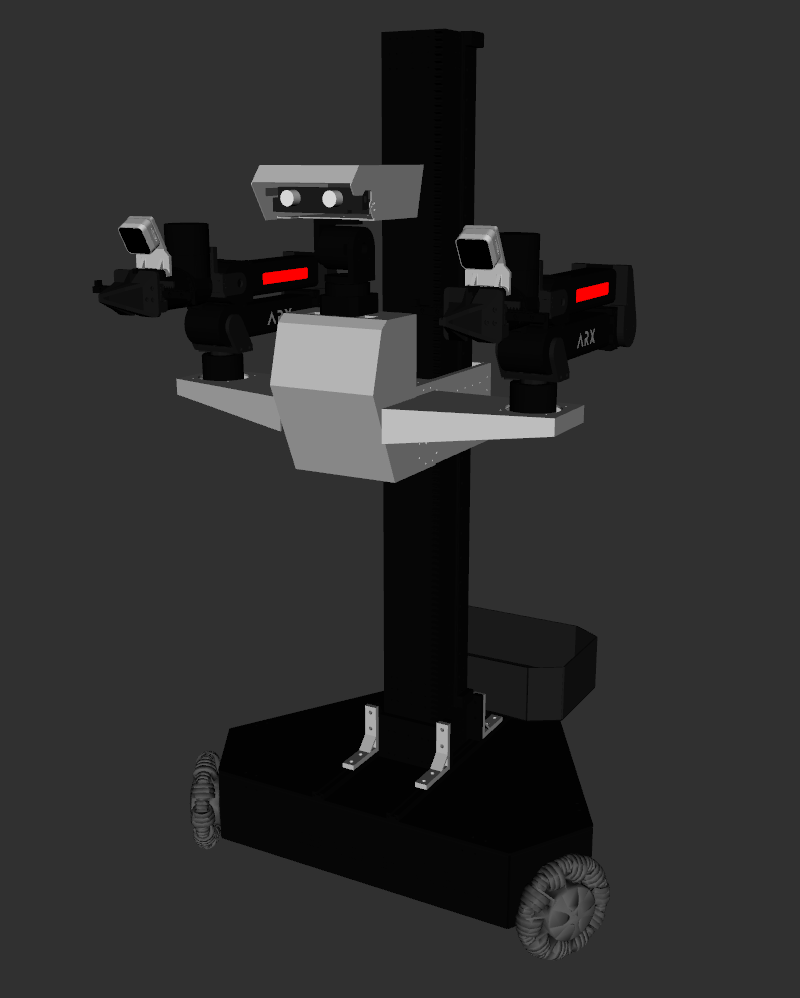
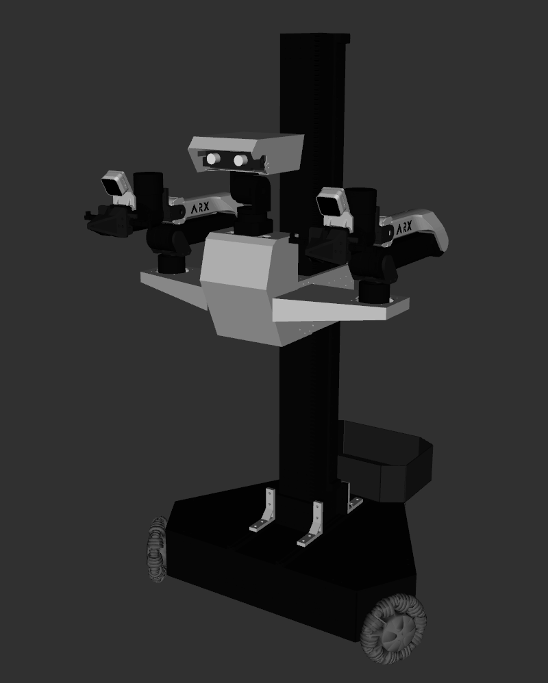

# ARX Lift Description

* Origin Repo: [ARX_Models](https://github.com/ARXroboticsX/ARX_Model)

## 1. Build
```bash
cd ~/ros2_ws
colcon build --packages-up-to lift_description --symlink-install
```

## 2. Visualize the robot

* Lift with R5 Arm
    ```bash
    source ~/ros2_ws/install/setup.bash
    ros2 launch robot_visualize_config manipulator.launch.py robot:=lift
    ```

    

* Lift with X5 Arm
    ```bash
    source ~/ros2_ws/install/setup.bash
    ros2 launch robot_visualize_config manipulator.launch.py robot:=lift arm_type:="x5"
    ```
    