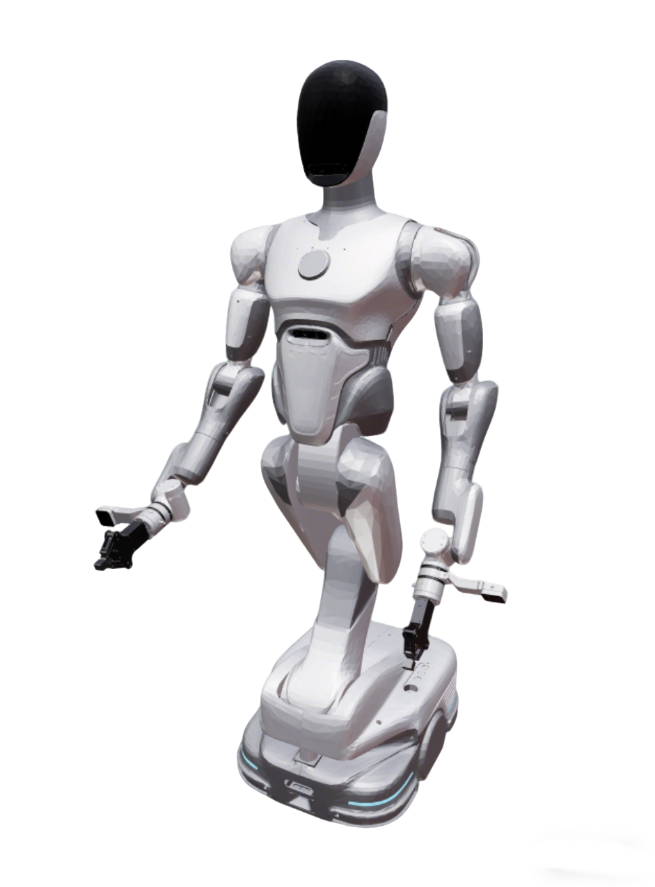

# Ai2 Bot2 Description

This package contains the URDF and configuration files for the Ai2 Bot2 humanoid. 

## 1. Build

```bash
cd ~/ros2_ws
colcon build --packages-up-to ai2_bot2_description --symlink-install
```

## 2. Visualize the robot
### 2.1 Full Robot
* Ai2 Bot2 (Basic visualization)
```bash
source ~/ros2_ws/install/setup.bash
ros2 launch robot_common_launch manipulator.launch.py robot:=ai2_bot2
```
* With Inspire EG2 Gripper
```bash
source ~/ros2_ws/install/setup.bash
ros2 launch robot_common_launch manipulator.launch.py robot:=ai2_bot2 type:=inspire
```



### 2.2 Component
* Base
  ```bash
  source ~/ros2_ws/install/setup.bash
  ros2 launch robot_common_launch component.launch.py robot:=ai2_bot2
  ```
* Arms
  ```bash
  source ~/ros2_ws/install/setup.bash
  ros2 launch robot_common_launch component.launch.py robot:=ai2_bot2 type:=arms
  ```
* Left arm
  ```bash
  source ~/ros2_ws/install/setup.bash
  ros2 launch robot_common_launch component.launch.py robot:=ai2_bot2 type:=left_arm
  ```

## 3. OCS2 Demo

### 3.1 Official OCS2 Mobile Manipulator Demo

```bash
source ~/ros2_ws/install/setup.bash
ros2 launch ocs2_arm_controller demo.launch.py robot:=dobot_atom
```
```bash
source ~/ros2_ws/install/setup.bash
ros2 launch ocs2_arm_controller demo.launch.py robot:=dobot_atom hardware:=isaac 
```

https://github.com/user-attachments/assets/ba05a717-cc46-4093-aa56-1ad4ea8a5264


