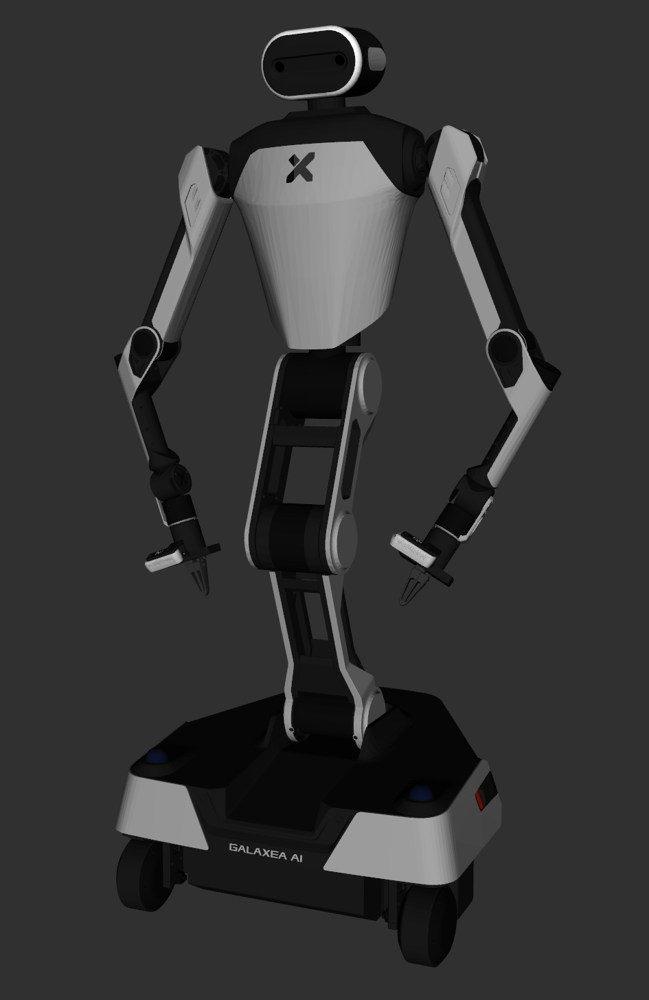
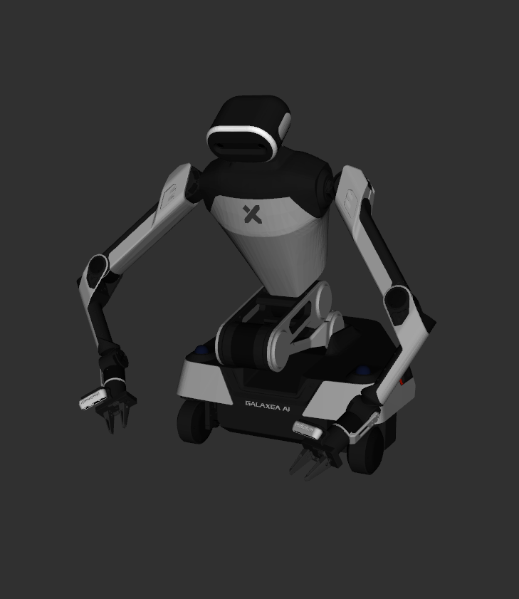

# Galaxea R1 Description

This package contains the description files for Galaxea R1 Humanoid Robot. The origin models could be found at [Galaxea URDF](https://github.com/userguide-galaxea/URDF).

## 1. Build
```bash
cd ~/ros2_ws
colcon build --packages-up-to galaxea_r1_description --symlink-install
```

## 2. Visualize the robot

```bash
source ~/ros2_ws/install/setup.bash
ros2 launch robot_visualize_config manipulator.launch.py robot:=galaxea_r1
```




## 3. OCS2 Demo
```bash
source ~/ros2_ws/install/setup.bash
ros2 launch robot_visualize_config manipulator_ocs2.launch.py robot_name:=galaxea_r1 dual_arm:=true
```