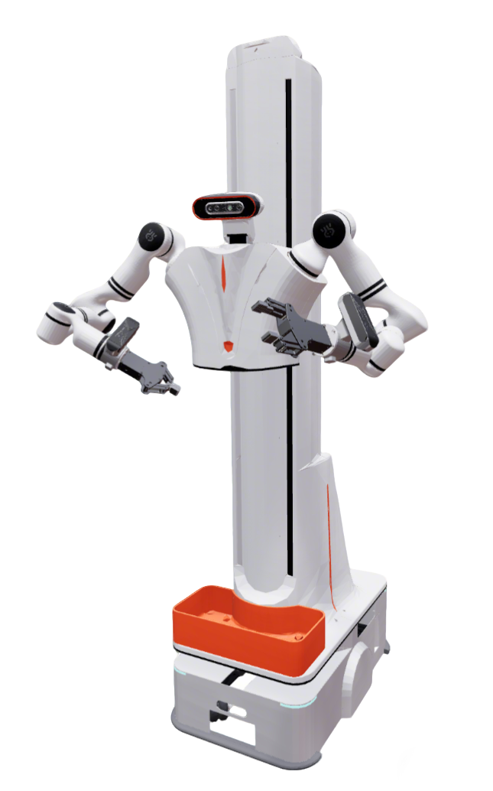

# Realman AIDAL Description

This package contains the description files for Realman Aidal(**AI Dual Arm Lift**).

## 1. Build
```bash
cd ~/ros2_ws
colcon build --packages-up-to aidal_description --symlink-install
```

## 2. Visualize the robot

### 2.1 Full Robot

```bash
source ~/ros2_ws/install/setup.bash
ros2 launch robot_common_launch manipulator.launch.py robot:=aidal
```

```bash
source ~/ros2_ws/install/setup.bash
ros2 launch robot_common_launch manipulator.launch.py robot:=aidal type:=eg2-4c2
```


### 2.2 Component

```bash
source ~/ros2_ws/install/setup.bash
ros2 launch robot_common_launch component.launch.py robot:=aidal
```

```bash
source ~/ros2_ws/install/setup.bash
ros2 launch robot_common_launch component.launch.py robot:=aidal type:=body
```
