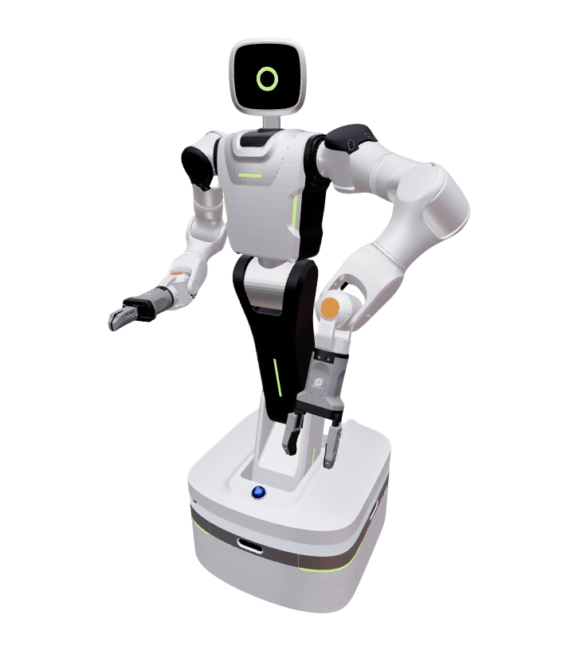

# Rokae INEX Description

轮式人形：底盘 + 4-DOF 躯干 + 2-DOF 头 + 双 AR5 CCS V2 臂。
躯干/头位置限位为占位值（原 SolidWorks URDF 为 fixed），需 CAD 复核。



| 模式 | Launch | OCS2 | 控制对象 |
|------|--------|------|----------|
| Full body | `full_body.launch.py` | `task.info`（虚拟全向基座 3 + 20-DOF） | 腰×4 + 双臂×7 + 头×2；底盘 SE(2) 规划，物理轮关节 `removeJoints` |
| Demo | `demo.launch.py` | `split.info` + `topology:=dual`（根 `arm_base`） | 仅双臂 |

## 1. Build

```bash
cd ~/ros2_ws
colcon build --packages-up-to rokae_inex_description --symlink-install
```

依赖 `ar5_ccs_description`（`AR5_CCS_V2` 与 INEX 硬件 xacro）。

## 2. Visualize

```bash
source ~/ros2_ws/install/setup.bash
ros2 launch robot_common_launch humanoid.launch.py robot:=rokae_inex
ros2 launch robot_common_launch humanoid.launch.py robot:=rokae_inex collider:=convex
ros2 launch robot_common_launch humanoid.launch.py robot:=rokae_inex type:=rg75
```

### 2.1 Component

```bash
ros2 launch robot_common_launch component.launch.py robot:=rokae_inex
ros2 launch robot_common_launch component.launch.py robot:=rokae_inex type:=chassis
ros2 launch robot_common_launch component.launch.py robot:=rokae_inex type:=body
ros2 launch robot_common_launch component.launch.py robot:=rokae_inex type:=arms
ros2 launch robot_common_launch component.launch.py robot:=rokae_inex type:=left_arm
ros2 launch robot_common_launch component.launch.py robot:=rokae_inex type:=right_arm
```

## 3. OCS2

RMW=zenoh 时先：`ros2 run rmw_zenoh_cpp rmw_zenohd`。

### 3.1 Full body

```bash
ros2 launch ocs2_arm_controller full_body.launch.py robot:=rokae_inex
ros2 launch ocs2_arm_controller full_body.launch.py robot:=rokae_inex hardware:=isaac
```

### 3.2 Demo（双臂）

RViz Fixed Frame = `arm_base`。

```bash
ros2 launch ocs2_arm_controller demo.launch.py robot:=rokae_inex
ros2 launch ocs2_arm_controller demo.launch.py robot:=rokae_inex hardware:=isaac
```

配置见 `config/ocs2/task.info`、`split.info` 与 `config/ros2_control/common.yaml`（频率 / home / 阈值 / 全身 OCS2 权重对齐 WCE3；腰 home 满足 `body_joint2 = -(body_joint1 + body_joint3)`）。默认 `collider:=simple`（躯干/底盘/头 box + AR5 CCS V2 圆柱），`selfCollision` 开启。臂复用 `AR5_CCS_V2` 的 `collider` / `skin`，以及 `eefs.xacro`（`type` / `left_type` / `right_type` / tcp offset）。头部模式：`headTrackingEE`（`HEAD_TRACKING`）、`headMidpointGaze`（`HEAD_GAZE`，`head_camera`）、`headCoupling`（`HEAD_FORWARD`）。

## 4. ROS2 Control

仿真默认 `hardware:=mock_components`。真机双臂走 iNexus（`arm_hardware_driver:=inex`），不接 Rokae IP 驱动；腰/头暂无真机插件。底盘轮关节不进 ros2_control。末端几何与接口复用 `ar5_ccs_description`（`eefs.xacro`、`dual_arm_ee_block`、`external_ee_systems`）。

```bash
source ~/ros2_ws/install/setup.bash
ros2 launch ocs2_arm_controller full_body.launch.py robot:=rokae_inex
ros2 launch ocs2_arm_controller demo.launch.py robot:=rokae_inex type:=rg75
```

真机末端驱动分别通过 `hardware_left_ee_drive_type` / `hardware_right_ee_drive_type`（xacro `left_ee_drive_type` / `right_ee_drive_type`）配置：

| 值 | 用途 |
|----|------|
| `none` | 默认；几何可挂、无末端硬件 |
| `inex_rs485` | iNexus RS485：AG2F90-D、LinkerHand O6/L6/O7 |
| `inex_can` | iNexus CAN：LinkerHand O6/L6/O7 |
| `usb` / `usb_rs485` | USB：LinkerHand、Freedom、Inspire、XHand1、TheoHand，以及 RG75、AG2F90-D |
| `usb_can` | USB-CAN：LinkerHand O6/L6/O7、Freedom V1、Inspire E2/F2 |

USB 口用 `hardware_usb_left_port` / `hardware_usb_right_port`，CAN 用 `hardware_left_ee_can_interface` / `hardware_right_ee_can_interface`，触觉读取用 `hardware_left_read_tactile` / `hardware_right_read_tactile`。夹爪/手控制器在 `common.yaml`：`left/right_gripper_controller`、`left/right_hand_controller`。

| 控制器 | 规划 / 任务文件 |
|--------|-----------------|
| `ocs2_wbc_controller` 全身 | 本包 `config/ocs2/task.info` |
| `ocs2_arm_controller` Demo 双臂 | 本包 `config/ocs2/split.info`；规划 URDF 为 `robot.xacro` + `topology:=dual` |
| `body_joint_controller` | `body_joint1~4` |
| `head_joint_controller` | `head_joint1~2` |

## 5. Kinematics notes

- 底盘四组舵轮：`fl/fr/rl/rr`，`{prefix}_steer_joint` 绕 Z，`{prefix}_wheel_joint` 绕 Y。
  steer 原点为转向座最大水平圆圆心，wheel 原点为轮盘 AABB 中心（轮旁小零件并入 `wheel.glb`）。
  整机默认锁轮（`chassis_joints_movable:=false`）；`type:=chassis` 可视化时解锁。
- 腰 `body_joint1..3` 为 pitch（轴 `0 1 0`），`body_joint4` 为 yaw（轴 `0 0 1`）。
- 头 `head_joint1` yaw、`head_joint2` pitch。
- 腰升降规划器：URDF `body_joint1~3` 均为 `+Y`，`waist_rotation_direction` 为 `[1, 1, 1]`。
- 连杆长度：`waist_l1=0.410`（小腿）、`waist_l2=0.480`（大腿）。
- 双臂安装于 `body_link4` / `arm_base`：左 `xyz="0 0.0775 0.1429" rpy="-1.57 1.57 0"`，右镜像。
