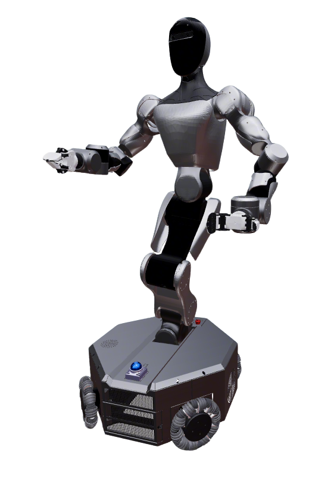

# MOZ1 Description

This package contains the description files for Spirit AI MOZ1 humanoid. The default model uses **OmniPicker** grippers from [`agibot_omni_description`](../../Agibot/agibot_omni_description); the chassis omni-wheels use [`component_models`](../../common/component_models) `omniwheel_10`.

## 1. Build

```bash
cd ~/ros2_ws
colcon build --packages-up-to moz1_description agibot_omni_description component_models sensor_models --symlink-install
```

## 2. Visualize the robot

### 2.1. Full robot

* MOZ1 Robot (Default)

  ```bash
  source ~/ros2_ws/install/setup.bash
  ros2 launch robot_common_launch humanoid.launch.py robot:=moz1
  ```



### 2.2. Component modules

* Wheel

  ```bash
  source ~/ros2_ws/install/setup.bash
  ros2 launch robot_common_launch component.launch.py robot:=moz1 type:=wheel
  ```

* Chassis

  ```bash
  source ~/ros2_ws/install/setup.bash
  ros2 launch robot_common_launch component.launch.py robot:=moz1 type:=chassis
  ```

  Chassis module uses `enable_wheel_joints:=true`: four **continuous** drive joints (empty wheel links, no wheel mesh).

* Body

  ```bash
  source ~/ros2_ws/install/setup.bash
  ros2 launch robot_common_launch component.launch.py robot:=moz1 type:=body
  ```

* Head

  ```bash
  source ~/ros2_ws/install/setup.bash
  ros2 launch robot_common_launch component.launch.py robot:=moz1 type:=head
  ```

* Arms

  ```bash
  source ~/ros2_ws/install/setup.bash
  ros2 launch robot_common_launch component.launch.py robot:=moz1 type:=arm
  ```

* Left Arm

  ```bash
  source ~/ros2_ws/install/setup.bash
  ros2 launch robot_common_launch component.launch.py robot:=moz1 type:=left_arm
  ```

* Right Arm

  ```bash
  source ~/ros2_ws/install/setup.bash
  ros2 launch robot_common_launch component.launch.py robot:=moz1 type:=right_arm
  ```

* MOZ1 Gripper (OmniPicker)

  ```bash
  source ~/ros2_ws/install/setup.bash
  ros2 launch robot_common_launch gripper.launch.py gripper:=moz1
  ```

## 3. OCS2 Demo

### 3.1 Official OCS2 Mobile Manipulator Demo

```bash
source ~/ros2_ws/install/setup.bash
ros2 launch robot_common_launch manipulator_ocs2.launch.py robot_name:=moz1
```

Fixed-base MPC (`config/ocs2/fixed_base.info`):

```bash
source ~/ros2_ws/install/setup.bash
ros2 launch robot_common_launch manipulator_ocs2.launch.py robot_name:=moz1 task_file:=fixed_base
```

### 3.2 Mock Component

```bash
source ~/ros2_ws/install/setup.bash
ros2 launch ocs2_arm_controller demo.launch.py robot:=moz1
```

### 3.3 Isaac Sim

```bash
source ~/ros2_ws/install/setup.bash
ros2 launch ocs2_arm_controller demo.launch.py robot:=moz1 hardware:=isaac
```