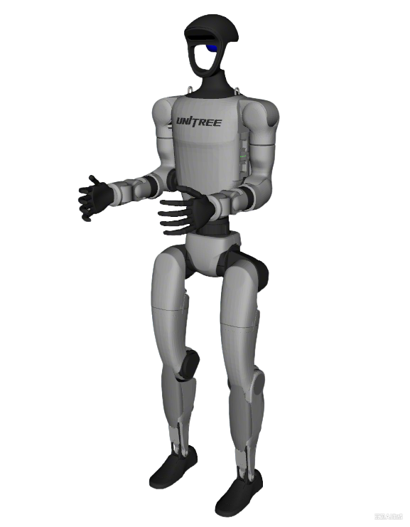
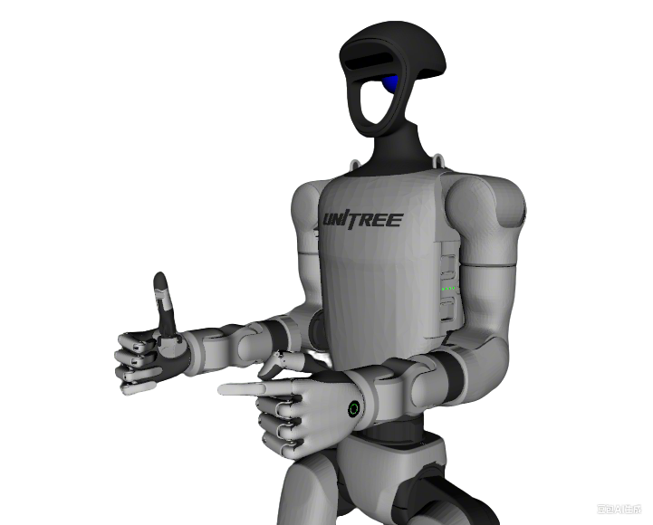

# Unitree G1 Description

This package contains the URDF and configuration files for the Unitree G1 humanoid. The origin models could be found at [booster_gym](https://github.com/BoosterRobotics/booster_gym).

## Build

```bash
cd ~/ros2_ws
colcon build --packages-up-to unitree_g1_description --symlink-install
```

## Visualize the robot

* G1 with rubber hand
  ```bash
  source ~/ros2_ws/install/setup.bash
  ros2 launch robot_visualize_config humanoid.launch.py
  ```
  

* G1 with BrainCo Revo2
  ```bash
  source ~/ros2_ws/install/setup.bash
  ros2 launch robot_visualize_config humanoid.launch.py end_effector:=revo2
  ```
  