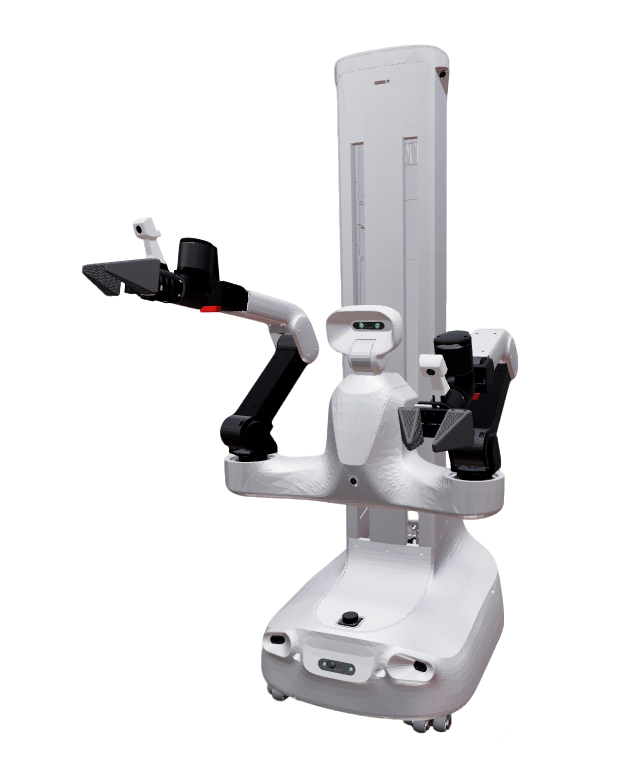

# X2Robot Quanta X1 Description

URDF / xacro and control configs for the XSquare **Quanta X1** wheeled dual-arm platform.

- Chassis: differential drive + prismatic **lift** + head yaw/pitch
- Arms: **Artixon 6A** (6-DOF) × 2
- Grippers: built-in parallel fingers; control follows the **ARX** pattern (`${prefix}gripper_joint` + `adaptive_gripper_controller`)

Upstream meshes: [XSquare Robot SDK](https://github.com/X-Square-Robot/sdk_robot).

## 1. Build

```bash
cd ~/ros2_ws
colcon build --packages-up-to quanta_x1_description --symlink-install
```

## 2. Visualize

### 2.1 Full robot

```bash
source ~/ros2_ws/install/setup.bash
ros2 launch robot_common_launch manipulator.launch.py robot:=quanta_x1
```



### 2.2 Components

```bash
source ~/ros2_ws/install/setup.bash
ros2 launch robot_common_launch component.launch.py robot:=quanta_x1 type:=base
ros2 launch robot_common_launch component.launch.py robot:=quanta_x1 type:=arm
```

## 3. Control (mock)

Uses `xacro/ros2_control/robot.xacro` with `hardware:=mock_components` (also `gz` / `isaac`).

### 3.1 Full body (全身 WBC)

Lift + dual Artixon 6A + head in one `ocs2_wbc_controller` (ARX Lift layout; chassis fixed).
OCS2 model: `config/ocs2/fixed_base_tcp.info`.

```bash
source ~/ros2_ws/install/setup.bash
ros2 launch ocs2_arm_controller full_body.launch.py robot:=quanta_x1
ros2 launch ocs2_arm_controller full_body.launch.py robot:=quanta_x1 hardware:=isaac
```

### 3.2 Dual-arm OCS2 demo

Artixon 6A dual arms via `ocs2_arm_controller`. Lift / head / grippers are separate controllers.

```bash
source ~/ros2_ws/install/setup.bash
ros2 launch ocs2_arm_controller demo.launch.py robot:=quanta_x1
ros2 launch ocs2_arm_controller demo.launch.py robot:=quanta_x1 hardware:=isaac
```

### 3.3 Split body (arms + lift + head)

```bash
source ~/ros2_ws/install/setup.bash
ros2 launch ocs2_arm_controller split_body.launch.py robot:=quanta_x1
```

- Arms: `/ocs2_arm_controller/...`
- Lift: `/body_joint_controller/...` (`lift_joint` [m], ARX-style single-joint waist lifting topics)
- Head: `/head_joint_controller/...`
- Grippers: `/left_gripper_controller`, `/right_gripper_controller` (`adaptive_gripper_controller` on `left_gripper_joint` / `right_gripper_joint`)

### 3.4 End-effector / gripper notes

- Joint names: `left_gripper_joint` / `right_gripper_joint` (mimic finger joints follow)
- TCP frames: `left_gripper_center` / `right_gripper_center`
- No separate `type:=` EEF switch: the Artixon 6A gripper is part of the arm xacro (same idea as ARX X5 built-in gripper)

### 3.5 Chassis joints (wheels / swivel casters)

Same convention as FiveAges W2 / Ai2 Bot2 / Galaxea R1 / ARX Lift2S:

- Default **`chassis_joints_movable:=false`**: drive wheels and swivel casters are **`fixed`** (viz, planning, and control URDFs).
- Set `chassis_joints_movable:=true` only when you need movable wheel/caster DOFs (e.g. component `type:=chassis`).
- **Not** in `ros2_control`: no `diff_drive` HI for mock arm stack. Lift is body (`body_joint_controller`), not chassis wheels.

```bash
ros2 launch robot_common_launch component.launch.py robot:=quanta_x1 type:=chassis
```

## 4. Layout

| Path | Role |
|------|------|
| `xacro/robot.xacro` | Visualization kinematics |
| `xacro/ros2_control/robot.xacro` | Hardware plugins + joint interfaces |
| `config/ros2_control/ros2_controllers.yaml` | Controller manager |
| `config/ocs2/task.info` | Dual-arm OCS2 model (demo / split arms) |
| `config/ocs2/fixed_base_tcp.info` | Full-body WBC (lift + arms + head); Pinocchio 4 order lift|head|L|R |
| `config/ocs2/target_manager.yaml` | Marker / VR frames (`base_link`, head_pitch_link) |
