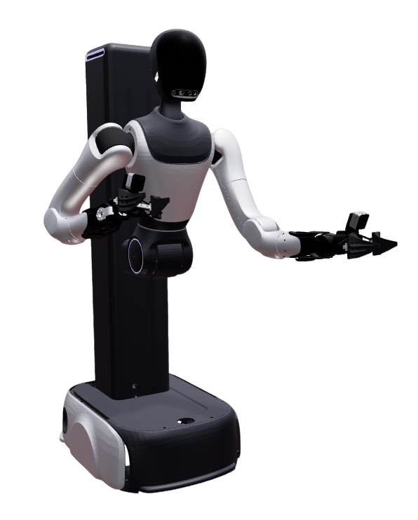

# Zerith H1 Description

URDF / xacro and control configs for the **Zerith H1** wheeled dual-arm platform.

- Chassis: differential drive (wheels locked by default)
- Body: prismatic lift (`body_joint1`) + pitch (`body_joint2`) + yaw (`body_joint3`)
- Head: yaw / pitch (`head_joint1` / `head_joint2`)
- Arms: 7-DOF × 2
- Grippers: built-in parallel jaws; control follows the **ARX** pattern (`${prefix}gripper_joint` + `adaptive_gripper_controller`)

Upstream models: [Zerith_Model](https://github.com/inFpZero/Zerith_Model).
Vendor dump kept under `urdf/` for provenance (not used by launch / OCS2).

## 1. Build

```bash
cd ~/ros2_ws
colcon build --packages-up-to zerith_h1_description --symlink-install
```

## 2. Visualize

### 2.1 Full robot

```bash
source ~/ros2_ws/install/setup.bash
ros2 launch robot_common_launch humanoid.launch.py robot:=zerith_h1
```



### 2.2 Components

```bash
source ~/ros2_ws/install/setup.bash
ros2 launch robot_common_launch component.launch.py robot:=zerith_h1 type:=base
ros2 launch robot_common_launch component.launch.py robot:=zerith_h1 type:=arms
ros2 launch robot_common_launch component.launch.py robot:=zerith_h1 type:=chassis
ros2 launch robot_common_launch component.launch.py robot:=zerith_h1 type:=body
```

## 3. Control (mock)

Uses `xacro/ros2_control/robot.xacro` with `hardware:=mock_components` (also `gz` / `isaac`).

### 3.1 Full body (全身 WBC)

Body + dual 7-DOF + head in one `ocs2_wbc_controller` (chassis fixed).
OCS2 model: `config/ocs2/fixed_base_tcp.info`.

```bash
source ~/ros2_ws/install/setup.bash
ros2 launch ocs2_arm_controller full_body.launch.py robot:=zerith_h1
ros2 launch ocs2_arm_controller full_body.launch.py robot:=zerith_h1 hardware:=isaac
```

### 3.2 Dual-arm OCS2 demo

Arms via `ocs2_arm_controller`. Body / head / grippers are separate controllers.

```bash
source ~/ros2_ws/install/setup.bash
ros2 launch ocs2_arm_controller demo.launch.py robot:=zerith_h1
ros2 launch ocs2_arm_controller demo.launch.py robot:=zerith_h1 hardware:=isaac
```

### 3.3 Split body (arms + body + head)

```bash
source ~/ros2_ws/install/setup.bash
ros2 launch ocs2_arm_controller split_body.launch.py robot:=zerith_h1
```

- Arms: `/ocs2_arm_controller/...`
- Body: `/body_joint_controller/...` (`body_joint1` lift [m], single-joint waist lifting)
- Head: `/head_joint_controller/...`
- Grippers: `/left_gripper_controller`, `/right_gripper_controller`

### 3.4 End-effector / gripper notes

- Joint names: `left_gripper_joint` / `right_gripper_joint` (mimic `*_jaw_right_finger_joint` follow)
- TCP frames: `left_end_effector_link` / `right_end_effector_link`

### 3.5 Chassis joints (drive wheels)

Same convention as FiveAges W2 / Ai2 Bot2 / Quanta X1 / Galaxea:

- Default **`chassis_joints_movable:=false`**: drive wheels are **`fixed`**.
- Set `chassis_joints_movable:=true` only when you need movable wheel DOFs (e.g. component `type:=chassis`).
- **Not** in `ros2_control` for the mock arm / WBC stack.

```bash
ros2 launch robot_common_launch component.launch.py robot:=zerith_h1 type:=chassis
```

## 4. Layout

| Path | Role |
|------|------|
| `xacro/robot.xacro` | Visualization kinematics |
| `xacro/ros2_control/robot.xacro` | Hardware plugins + joint interfaces |
| `config/ros2_control/ros2_controllers.yaml` | Controller manager |
| `config/ocs2/task.info` | Dual-arm OCS2 model (demo / split arms) |
| `config/ocs2/fixed_base_tcp.info` | Full-body WBC (body + arms + head); Pinocchio 4 order body\|head\|L\|R |
| `config/ocs2/target_manager.yaml` | Marker / VR frames (`base_link`, `neck_pitch_link`) |
| `urdf/` | Vendor dump (provenance only) |
