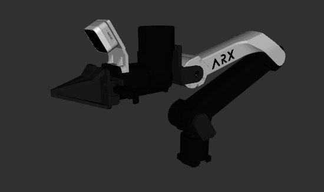

# ARX X5 Description

This package contains the description files for ARX X5 Manipulator. The origin models could be found at [ARX_Models](https://github.com/ARXroboticsX/ARX_Model)

## 1. Build
```bash
cd ~/ros2_ws
colcon build --packages-up-to x5_description --symlink-install
```

## 2. Visualize the robot

To visualize and check the configuration of the robot in rviz, simply launch:

```bash
source ~/ros2_ws/install/setup.bash
ros2 launch robot_visualize_config manipulator.launch.py robot:=x5
```



## 3. OCS2 Demo
```bash
source ~/ros2_ws/install/setup.bash
ros2 launch robot_visualize_config manipulator_ocs2.launch.py robot_name:=x5
```