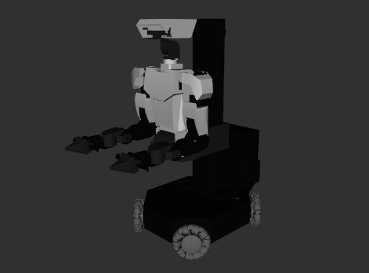

# ARX X7S Description

* Origin Repo: [ARX_Models](https://github.com/ARXroboticsX/ARX_Model)

## 1. Build
```bash
cd ~/ros2_ws
colcon build --packages-up-to x7s_description --symlink-install
```

## 2. Visualize the robot

To visualize and check the configuration of the robot in rviz, simply launch:

```bash
source ~/ros2_ws/install/setup.bash
ros2 launch robot_visualize_config manipulator.launch.py robot:=x7s
```

