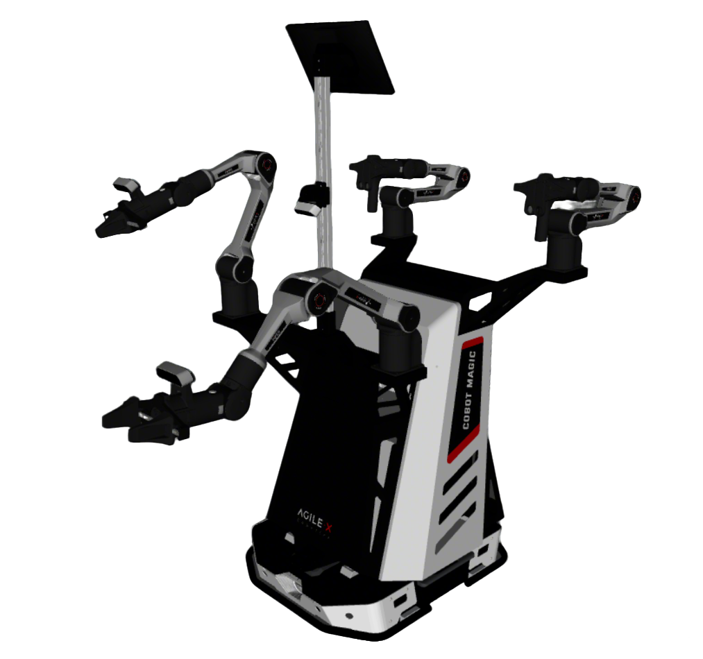

# Cobot Magic V2 Description

AgileX **Cobot Magic V2**（原 Mobile Aloha V2）：Tracer / Tracer V2 底盘 + 固定躯干 + 双臂（`arms:=piper|h|l|x`）+ 夹爪或 BrainCo Revo1/Revo2（`type:=gripper|revo1|revo2|none`）。
无腰 / 升降 / 头等身体自由度，因此没有分体控制：只有全身 WBC 与双臂 `demo`。

| 模式 | Launch | OCS2 | 控制对象 |
|------|--------|------|----------|
| Full body | `full_body.launch.py` | `task.info`（`ocs2_wheel_humanoid`） | 底盘 SE(2) + 双臂 |
| Demo | `demo.launch.py` | `task_arm.info` + `topology:=dual`（根 `arm_base`） | 仅双臂 |

Demo 规划：`robot.xacro` 在 `topology:=dual` 时只生成 `arm_base` + 双臂（不含底盘 / 躯干）。`arm_base` 与 `body_Link` 重合。

全身 WBC 状态：`[base x,y,yaw | left×6 | right×6]`。H/L/X 与标准 Piper 一样都是 6 轴、`tcp`、`left_/right_joint1–6`，OCS2 `task.info` / `task_arm.info` 不用改。未做 `collider:=simple` 前不要开 `selfCollision`。

| 参数 | 默认 | 取值 |
|------|------|------|
| `chassis` | `tracer_v2` | `tracer` / `tracer_v2` |
| `arms` | `piper` | `piper` / `h` / `l` / `x` |
| `type` | `""`→`gripper` | `gripper` / `revo1` / `revo2` / `none` |

## 1. Build

```bash
cd ~/ros2_ws
colcon build --packages-up-to cobot_magic_v2_description --symlink-install
```

## 2. Visualize

默认：Tracer V2 + 标准双 Piper + 作业夹爪 + 腕部相机 TF。

```bash
source ~/ros2_ws/install/setup.bash
ros2 launch robot_common_launch manipulator.launch.py robot:=cobot_magic_v2
```



| 场景 | 参数 |
|------|------|
| Tracer V1 底盘 | `chassis:=tracer` |
| Piper H / L / X | `arms:=h` / `l` / `x` |
| 裸腕 | `type:=none` |
| Revo1 | `type:=revo1`（默认关相机） |
| Revo2 | `type:=revo2`（默认关相机） |

```bash
ros2 launch robot_common_launch manipulator.launch.py robot:=cobot_magic_v2 chassis:=tracer
ros2 launch robot_common_launch manipulator.launch.py robot:=cobot_magic_v2 arms:=h
ros2 launch robot_common_launch manipulator.launch.py robot:=cobot_magic_v2 type:=revo2
ros2 launch robot_common_launch manipulator.launch.py robot:=cobot_magic_v2 arms:=x type:=revo1
```

### 2.1 Component

`component.xacro` 的 `type:=tracer_v2|tracer|body` 只出单件，与整机 EEF `type` 不是同一入口。

* Tracer V2 底盘（默认）
  ```bash
  ros2 launch robot_common_launch component.launch.py robot:=cobot_magic_v2
  ```
* Tracer V1 底盘
  ```bash
  ros2 launch robot_common_launch component.launch.py robot:=cobot_magic_v2 type:=tracer
  ```
* 躯干
  ```bash
  ros2 launch robot_common_launch component.launch.py robot:=cobot_magic_v2 type:=body
  ```

## 3. OCS2

RMW=zenoh 时先：`ros2 run rmw_zenoh_cpp rmw_zenohd`。

### 3.1 Full body

RViz Fixed Frame = `world`（不要用 `base_link`）。

```bash
ros2 launch ocs2_arm_controller full_body.launch.py robot:=cobot_magic_v2
ros2 launch ocs2_arm_controller full_body.launch.py robot:=cobot_magic_v2 hardware:=isaac
ros2 launch ocs2_arm_controller full_body.launch.py robot:=cobot_magic_v2 chassis:=tracer
ros2 launch ocs2_arm_controller full_body.launch.py robot:=cobot_magic_v2 type:=revo2 arms:=x hardware:=isaac
```

### 3.2 Demo（双臂）

RViz Fixed Frame = `arm_base`。

```bash
ros2 launch ocs2_arm_controller demo.launch.py robot:=cobot_magic_v2
ros2 launch ocs2_arm_controller demo.launch.py robot:=cobot_magic_v2 hardware:=isaac
ros2 launch ocs2_arm_controller demo.launch.py robot:=cobot_magic_v2 arms:=h type:=revo1
```

配置见 `config/ocs2/task.info`、`task_arm.info` 与 `config/ros2_control/common.yaml`。
