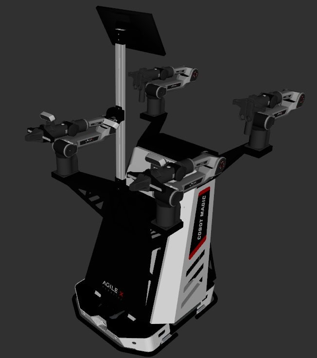

# AgileX Mobile Aloha2 Description

This package contains the description files for AgileX's Mobile Aloha2 manipulator. The origin models can be found at [mobile aloha sim](https://github.com/agilexrobotics/mobile_aloha_sim/tree/v2.0.0)

## 1. Build
```bash
cd ~/ros2_ws
colcon build --packages-up-to mobile_aloha2_description --symlink-install
```

## 2. Visualize the robot

To visualize and check the configuration of the robot in rviz, simply launch:

```bash
source ~/ros2_ws/install/setup.bash
ros2 launch mobile_aloha2_description visualize.launch.py
```

