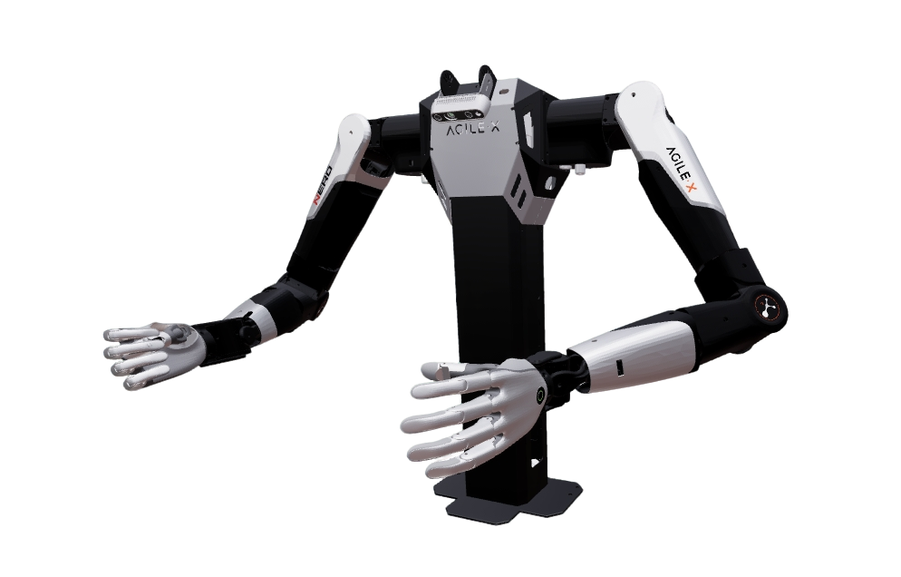

# Open Nero Description

AgileX Open Nero：固定工作台 + 双臂 Nero + 末端（默认平行夹爪）+ 顶置 / 腕部 RealSense D435。



复用方式与 `marvin_pro` 相同：

- 臂与末端：`nero_description` 的 `Nero` / `NeroEndEffectors`
- 顶置相机支架网格：直接用 `cobot_magic_v2_description` 的 `camera_stand2.glb`（不另拷一份）
- 底座、双臂安装位姿与相机：本包 `components/base.xacro`、`components/cameras.xacro`

厂商原始模型见 [`open_nero-master`](../open_nero-master/)。

## Build

```bash
cd ~/ros2_ws
colcon build --packages-up-to open_nero_description --symlink-install
source install/setup.bash
```

## Visualize

```bash
# 默认：双臂 + 平行夹爪 + 相机；collider:=simple（立柱圆柱 + Nero 连杆 primitive）
ros2 launch robot_common_launch manipulator.launch.py robot:=open_nero

# 原网格碰撞
ros2 launch robot_common_launch manipulator.launch.py robot:=open_nero collider:=convex

# Revo2
ros2 launch robot_common_launch manipulator.launch.py robot:=open_nero type:=revo2

# 裸腕
ros2 launch robot_common_launch manipulator.launch.py robot:=open_nero type:=none

# 左右不同末端
ros2 launch robot_common_launch manipulator.launch.py robot:=open_nero \
  left_type:=gripper right_type:=revo2
```

### Component

`component.xacro` 的 `type:=body` 只出工作台和顶置相机（不含双臂 / 末端）。Isaac 资源导入用 `xacro_isaac:=true`（藏 `sensor_models` 头部相机网格），与 `hardware:=isaac` 无关。组件默认已隐藏传感器；要看外形时传 `xacro_isaac:=false`。

```bash
ros2 launch robot_common_launch component.launch.py robot:=open_nero
ros2 launch robot_common_launch component.launch.py robot:=open_nero type:=body
ros2 launch robot_common_launch component.launch.py robot:=open_nero type:=body xacro_isaac:=false
```

整机导入 Isaac 时同样可藏相机网格：

```bash
ros2 launch robot_common_launch manipulator.launch.py robot:=open_nero xacro_isaac:=true
```

## Control / OCS2

固定基座双臂 demo（无底盘 WBC）：

```bash
ros2 launch ocs2_arm_controller demo.launch.py robot:=open_nero
ros2 launch robot_common_launch manipulator_ocs2.launch.py robot_name:=open_nero
```

OCS2 按默认平行夹爪编写（`left_gripper_center` / `right_gripper_center`）。规划 URDF 默认 `collider:=simple`：工作台只碰中间立柱，相机架无碰撞；`selfCollision` 打开。

## Type keys

`type` / `left_type` / `right_type` 与单臂 Nero 相同：`gripper`（默认）、`revo2`、`none`。`type:=revo2` 时左臂 `direction=1`、右臂 `direction=-1`，不会两侧都挂左手。
