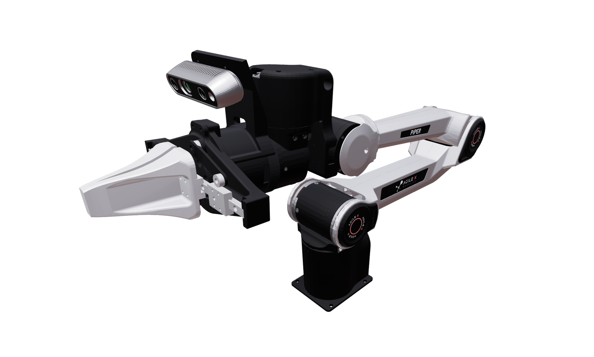
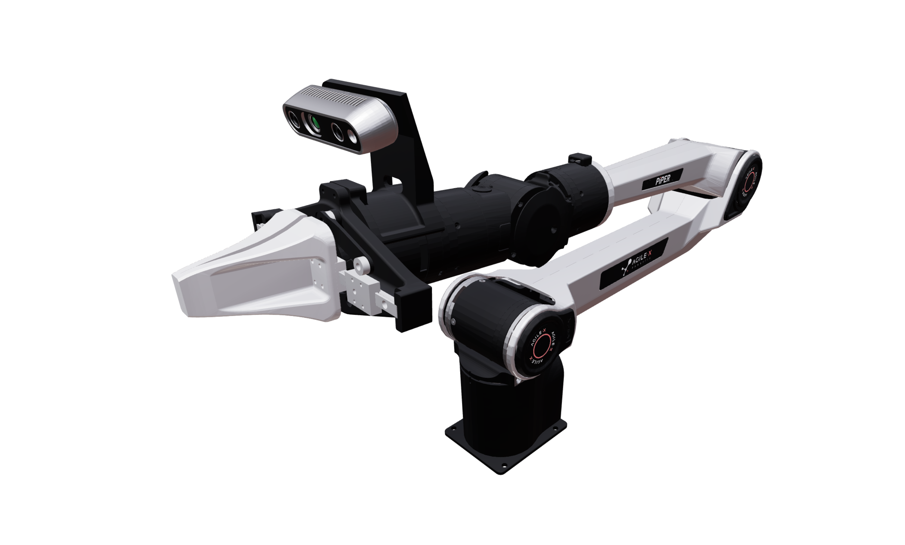

# AgileX Piper Description

This package contains the URDF and related files for the AgileX Piper robot manipulator. The origin models can be found
at [mobile aloha sim](https://github.com/agilexrobotics/mobile_aloha_sim/tree/v2.0.0)

## 1. Build

```bash
cd ~/ros2_ws
colcon build --packages-up-to piper_description --symlink-install
```

## 2. Visualize the robot

* Piper with Slave Arm and camera
    ```bash
    source ~/ros2_ws/install/setup.bash
    ros2 launch robot_common_launch manipulator.launch.py robot:=piper type:=slave
    ```
  
* Piper with Master Arm
    ```bash
    source ~/ros2_ws/install/setup.bash
    ros2 launch robot_common_launch manipulator.launch.py robot:=piper type:=master
    ```
  

* Piper_x
  ```bash
  source ~/ros2_ws/install/setup.bash
  ros2 launch robot_common_launch manipulator.launch.py robot:=piper type:=piper_x
  ```
  
* Piper_l
  ```bash
  source ~/ros2_ws/install/setup.bash
  ros2 launch robot_common_launch manipulator.launch.py robot:=piper type:=piper_l
  ```
  
## 3. OCS2 Demo

### 3.1 Official OCS2 Mobile Manipulator Demo
* Piper 
```bash
source ~/ros2_ws/install/setup.bash
ros2 launch robot_common_launch manipulator_ocs2.launch.py robot_name:=piper
```
[Screencast from 2025-08-29 18-43-41.webm](https://github.com/user-attachments/assets/1818286f-fb3d-4e65-a7d7-69a66623713f)

* Piper_x
```bash
source ~/ros2_ws/install/setup.bash
ros2 launch robot_common_launch manipulator_ocs2.launch.py robot_name:=piper type:=x
```
* Piper_l
```bash
source ~/ros2_ws/install/setup.bash
ros2 launch robot_common_launch manipulator_ocs2.launch.py robot_name:=piper type:=l
```

### 3.2 OCS2 Arm Controller Demo
* Gazebo
  ```bash
  source ~/ros2_ws/install/setup.bash
  ros2 launch ocs2_arm_controller demo.launch.py robot:=piper hardware:=gz world:=warehouse
  ```
  

  https://github.com/user-attachments/assets/80146909-8668-486f-9baa-343274c5f109


* Isaac Sim
  ```bash
  source ~/ros2_ws/install/setup.bash
  ros2 launch ocs2_arm_controller demo.launch.py robot:=piper hardware:=isaac
  ```
  

  https://github.com/user-attachments/assets/6b0494c8-0f7f-47d1-b13e-15c886780035

