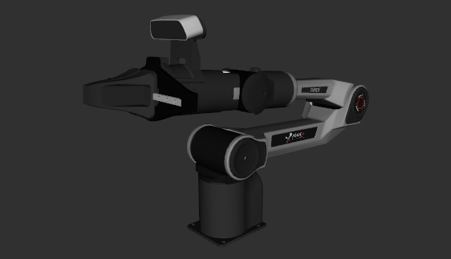

# AgileX Piper Description

## 1. Build
```bash
cd ~/ros2_ws
colcon build --packages-up-to piper_description --symlink-install
```

## 2. Visualize the robot

* Launch Slave Arm with camera
    ```bash
    source ~/ros2_ws/install/setup.bash
    ros2 launch robot_visualize_config manipulator.launch.py
    ```
    
* Launch Master Arm
    ```bash
    source ~/ros2_ws/install/setup.bash
    ros2 launch robot_visualize_config manipulator.launch.py arm_type:="master"
    ```
    

## 3. OCS2 Demo
```bash
source ~/ros2_ws/install/setup.bash
ros2 launch lift_description ocs2.launch.py
```