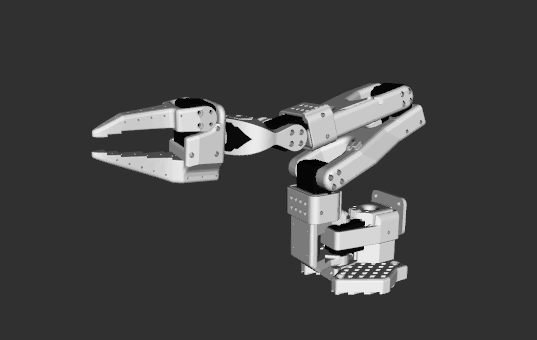

# XLeRobot Description

* camera support: [WowRobot](https://wowrobo.com/home)
* camera model: [3dwhere](https://www.3dwhere.com/models/606v9dvz913o54jn)

## 1. Build
```bash
cd ~/ros2_ws
colcon build --packages-up-to xlerobot_description --symlink-install
```

## 2. Visualize the robot

```bash
source ~/ros2_ws/install/setup.bash
ros2 launch robot_visualize_config manipulator.launch.py robot:=xlerobot
```
  
