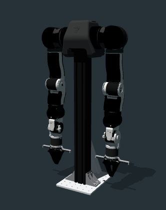
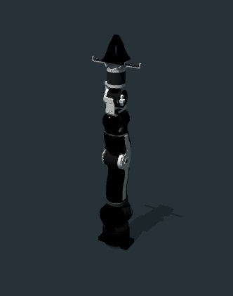

# OpenArm v1.0 Description

This package contains the description files for OpenArm single and bimanual manipulator. I got the origin XACRO files from
the [OpenArm XACRO](https://github.com/enactic/openarm_description).

Note: The /meshes/arm/v10/visual/link0.dae file may cause the model not shown due error of `Not enough data for accessor`. You can change it to .stl file with same suffix name. Howere, the stl file will have render issue in both rviz and gazebo. So does 

## 1. Build

```bash
cd ~/ros2_ws
colcon build --packages-up-to openarm_description --symlink-install
```

## 2. Visualize the robot

* OpenArm Bimanual
  ```bash
  source ~/ros2_ws/install/setup.bash
  ros2 launch robot_visualize_config manipulator.launch.py robot:=openarm type:=bimanual
  ```

  

* Left arm only
  ```bash
  source ~/ros2_ws/install/setup.bash
  ros2 launch robot_visualize_config manipulator.launch.py robot:=openarm type:=left
  ```

  
* Right arm only
  ```bash
  source ~/ros2_ws/install/setup.bash
  ros2 launch robot_visualize_config manipulator.launch.py robot:=openarm type:=right
  ```

  


## 3. OCS2 Demo

### 3.1 Official OCS2 Mobile Manipulator Demo
  
* OpenArm Bimanual
  ```bash
  # Need to copy and replace task_bimanual.info content into task.info
  source ~/ros2_ws/install/setup.bash
  ros2 launch robot_visualize_config manipulator_ocs2.launch.py robot_name:=openarm
  ```
* OpenArm Single Left
  ```bash
  # Need to copy replace task_single.info content into task.info
  source ~/ros2_ws/install/setup.bash
  ros2 launch robot_visualize_config manipulator_ocs2.launch.py robot_name:=openarm type:=left task_file:=single
  ```

### 3.2 OCS2 Arm Controller Demo
Note: need to check the .xacro file under ros2_control, make sure when ros2_control_hardware_type == isaac, the joint_command is not joint_command's'!!!

* OpenArm Bimanual
  ```bash
  # Need to copy and replace openarm_bimanual.yaml content into ros2_contorllers.yaml
  source ~/ros2_ws/install/setup.bash
  ros2 launch ocs2_arm_controller demo.launch.py robot:=openarm_v10 type:=bimanual
  ```
* OpenArm Single (hardware:=gz is optional)
  ```bash
  # Need to copy and replace openarm_single.yaml content into ros2_contorllers.yaml
  source ~/ros2_ws/install/setup.bash
  ros2 launch ocs2_arm_controller demo.launch.py robot:=openarm_v10 hardware:=gz type:=single
  ```
