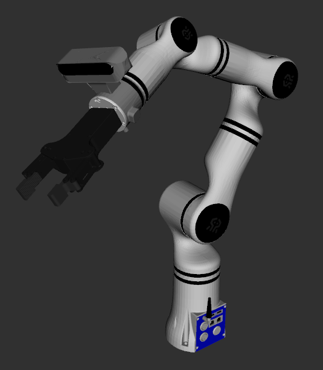

# Realman RM65 Description

This package contains the description files for Galaxea A1X and A1Y manipulator. I got the origin URDF files from the [Galaxea URDF](https://github.com/userguide-galaxea/URDF).

## 1. Build
```bash
cd ~/ros2_ws
colcon build --packages-up-to rm65_description --symlink-install
```

## 2. Visualize the robot

```bash
source ~/ros2_ws/install/setup.bash
ros2 launch robot_visualize_config manipulator.launch.py robot:=rm65
```

