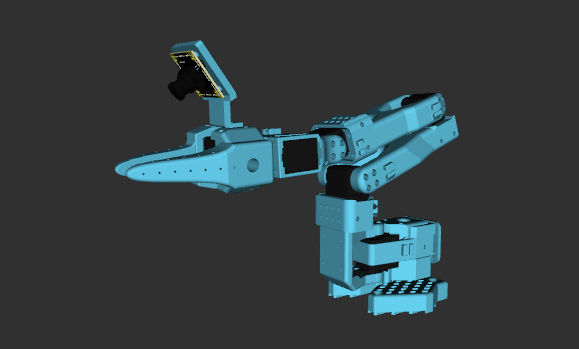

# SO Arm Description

* camera support: [WowRobot](https://wowrobo.com/home)
* camera model: [3dwhere](https://www.3dwhere.com/models/606v9dvz913o54jn)

## 1. Build
```bash
cd ~/ros2_ws
colcon build --packages-up-to so_arm_description --symlink-install
```

## 2. Visualize the robot

* SO100
  ```bash
  source ~/ros2_ws/install/setup.bash
  ros2 launch robot_visualize_config manipulator.launch.py robot:=so_arm arm_type:=so100
  ```
    

* SO101
  ```bash
  source ~/ros2_ws/install/setup.bash
  ros2 launch robot_visualize_config manipulator.launch.py robot:=so_arm
  ```
    

## 3. OCS2 Demo

* SO101
  ```bash
  source ~/ros2_ws/install/setup.bash
  ros2 launch robot_visualize_config manipulator_ocs2.launch.py robot_name:=so_arm
  ```